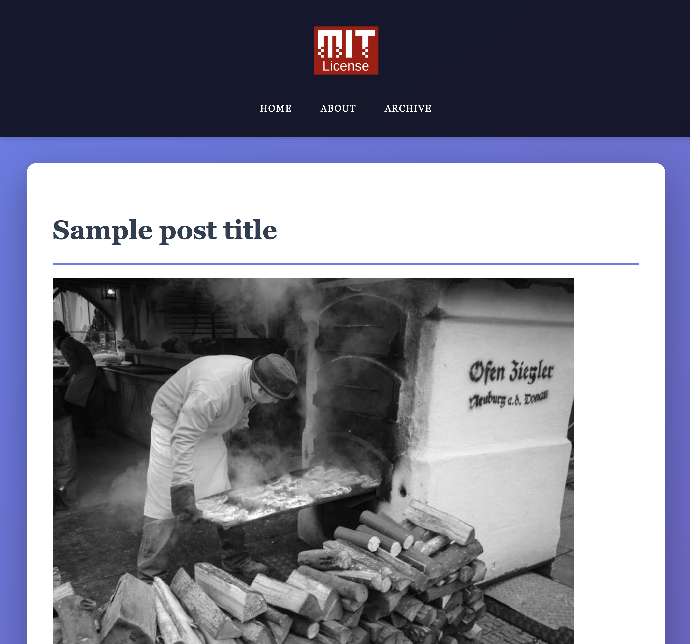
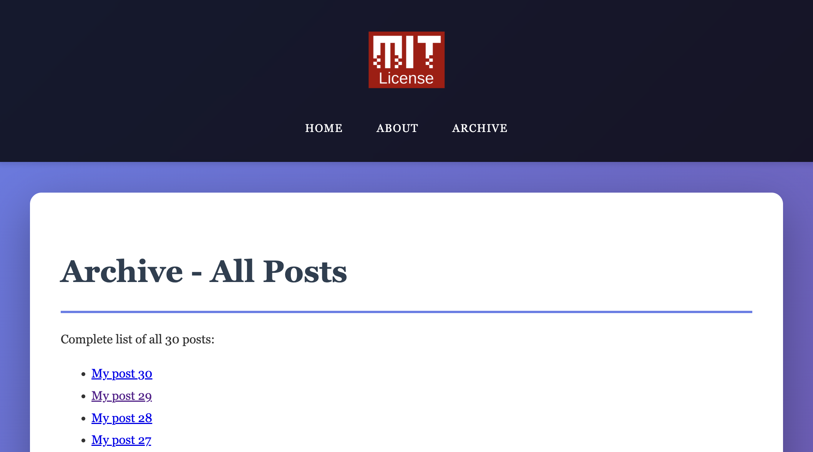
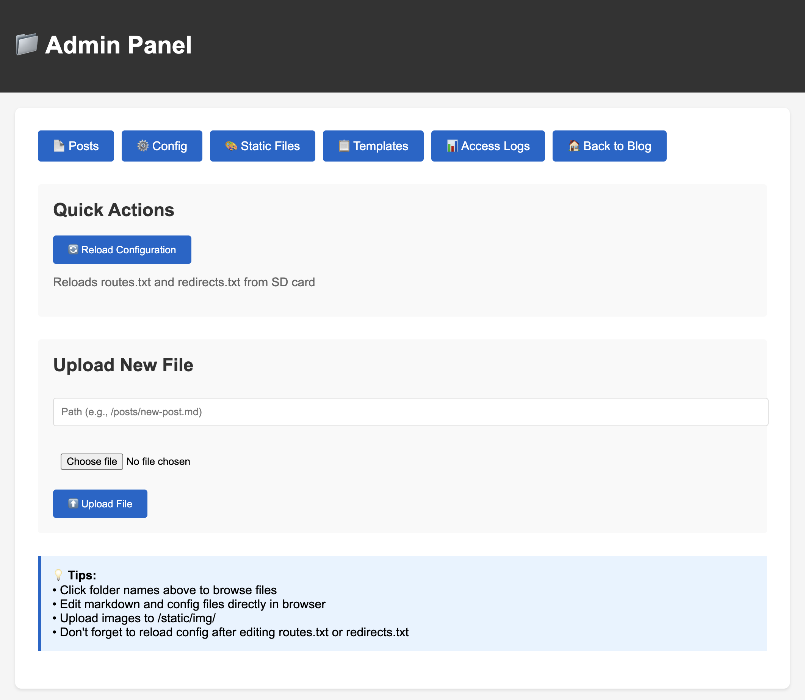
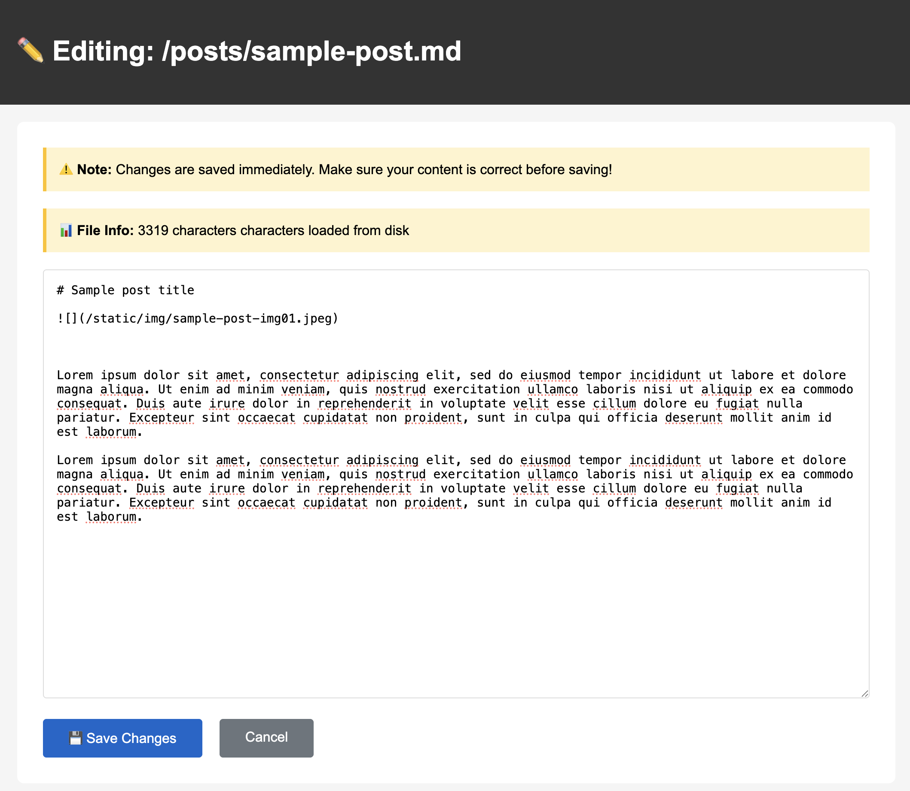
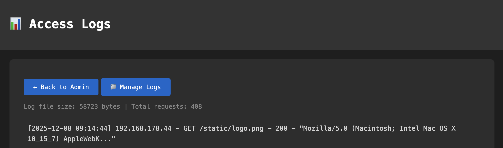
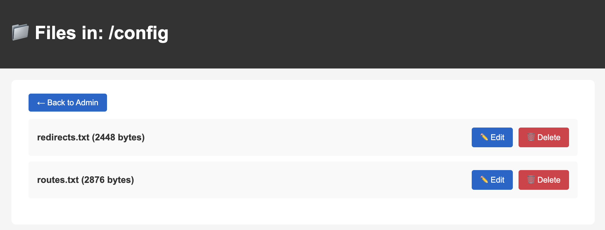
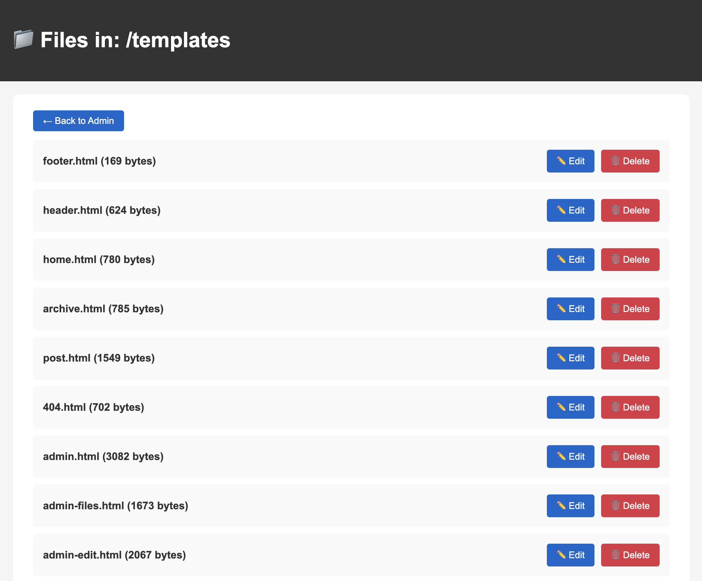
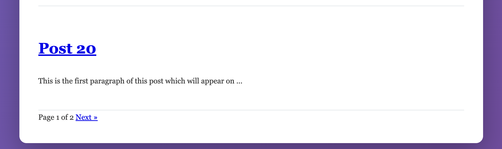

# ESP8266 SD Card Blog Server

A fully-featured, self-hosted blog server running on an ESP8266 microcontroller with all content stored on an SD card. Perfect for low-power, offline-first blogging.


> **✨ Version 2.0 - Modular Architecture**  
> The codebase has been refactored into a clean modular structure for better maintainability and organization. All features remain the same!

## 📸 Screenshots

<table>
  <tr>
    <td width="50%">
      
      <p align="center"><b>Homepage</b> - Clean post listing with pagination</p>
    </td>
    <td width="50%">
      
      <p align="center"><b>Post View</b> - Markdown rendered beautifully</p>
    </td>
  </tr>
  <tr>
    <td width="50%">
      
      <p align="center"><b>Archive</b> - Complete post index</p>
    </td>
    <td width="50%">
      
      <p align="center"><b>Admin Panel</b> - Web-based file manager</p>
    </td>
  </tr>
  <tr>
    <td width="50%">
      
      <p align="center"><b>Post Editor</b> - Edit markdown in browser</p>
    </td>
    <td width="50%">
      
      <p align="center"><b>Traffic Logs</b> - Monitor all requests</p>
    </td>
  </tr>
</table>

<details>
<summary>📂 More Screenshots</summary>

### Admin Features
- **Config Editor**: Edit routes and redirects on the fly  
  

- **Template Manager**: Modify HTML templates without recompiling  
  

- **Pagination**: Navigate through posts smoothly  
  

</details>

## Features

### Core Functionality
- **Self-Hosted Blog Server** - Complete HTTP web server on ESP8266
- **SD Card Storage** - All content (posts, images, CSS) on removable SD card
- **Markdown Support** - Write posts in Markdown, rendered client-side with marked.js
- **Custom URL Mapping** - Define clean URLs for each post
- **Pagination** - Automatic post pagination (20 posts per page)
- **Archive Page** - Complete list of all blog posts
- **URL Redirects** - Support for legacy URL redirections

### Template System
- **100% Template-Based** - Zero hardcoded HTML/CSS/JS in Arduino code
- **Live Editing** - Edit templates on SD card without recompiling
- **Full Customization** - Custom CSS, logos, page layouts
- **Seven Templates** - Home, Archive, Post, 404, Admin pages

### Admin Panel
- **Web-Based File Manager** - Edit files directly in your browser
- **HTTP Basic Auth** - Password-protected admin interface
- **File Operations** - Upload, edit, delete files without removing SD card
- **Configuration Reload** - Apply changes without restart
- **Mobile-Friendly** - Responsive admin interface

### Traffic Logging
- **NTP Time Sync** - Real timestamps from NTP servers
- **Access Logs** - Track every visit (IP, method, URL, User-Agent, status)
- **Automatic Rotation** - Log rotation at 500KB
- **Web Viewer** - View logs in browser with dark theme
- **Serial Output** - Real-time monitoring via Serial Monitor

### Advanced Features
- **WiFi Auto-Reconnect** - Automatic reconnection with visual LED feedback
- **Image Serving** - Serve JPG, PNG, GIF from SD card
- **Native Lazy Loading** - Images load on scroll
- **Memory Optimized** - Streaming from SD card, minimal RAM usage
- **Post Previews** - Automatic excerpt generation for homepage

## Project Structure

The project is organized into two main folders:

```
ESP8266-blog-server/
├── firmware/            # ESP8266 firmware files
│   ├── esp82_blog_server.ino   # ⭐ Main entry point
│   ├── config.h                # Configuration & credentials
│   ├── initializer.h           # System initialization
│   ├── logger.h                # Traffic logging
│   ├── parser.h                # Template parsing
│   ├── server.h                # Web server routes
│   └── admin.h                 # Admin panel
│
└── sd-card-content/        # Files for SD card
    ├── config/             # Configuration files
    ├── posts/              # Blog posts (markdown)
    ├── static/             # CSS, images, assets
    ├── templates/          # HTML templates
    └── logs/               # Access logs
```

The server uses a **modular architecture** with separate files for each responsibility:

### Module Responsibilities

| Module | Purpose | Key Functions |
|--------|---------|---------------|
| **config.h** | WiFi credentials, pins, settings | Configuration constants |
| **initializer.h** | System startup & monitoring | `initSDCard()`, `connectWiFi()`, `syncTime()` |
| **logger.h** | HTTP request logging | `logTraffic()` |
| **parser.h** | Template & markdown handling | `loadTemplate()`, `getPostPreview()` |
| **server.h** | HTTP request routing | `servePost()`, `handleArchive()` |
| **admin.h** | Admin panel & auth | `handleAdminPanel()`, `checkAuth()` |

**Benefits:**
- ✅ Easy to find and modify specific features
- ✅ Better code organization and readability  
- ✅ Simpler debugging and testing
- ✅ Easier to add new features

## Hardware Requirements

- **Wemos Lolin D1 Pro Mini V2.0.0** (or compatible ESP8266 board)
- **Micro SD Card Shield** (stacks directly on Wemos D1 Mini)
- **Micro SD Card** (formatted as FAT32, 2GB-32GB recommended)
- **USB cable** for programming

### Pin Configuration
The shield uses standard SPI pins:
- CS: D8 (GPIO15)
- SCK: D5 (GPIO14)
- MOSI: D7 (GPIO13)
- MISO: D6 (GPIO12)

## Quick Start

### 1. Hardware Setup
1. Stack the SD Card Shield on top of the Wemos D1 Mini
2. Solder the header pins
3. Insert FAT32-formatted SD card

### 2. SD Card Structure
Create this folder structure on your SD card:

```
SD_CARD/
├── config/
│   ├── routes.txt          # Post URL mappings
│   └── redirects.txt       # URL redirections
├── posts/
│   ├── post01.md           # Your blog posts
│   ├── post02.md
│   └── ...
├── static/
│   ├── style.css           # Custom CSS
│   ├── logo.png            # Your logo
│   └── images/             # Post images
├── templates/
│   ├── home.html           # Homepage template
│   ├── archive.html        # Archive page
│   ├── post.html           # Post template
│   ├── 404.html            # Error page
│   ├── admin.html          # Admin dashboard
│   ├── admin-files.html    # File browser
│   ├── admin-edit.html     # File editor
│   └── admin-success.html  # Success message
└── logs/
    ├── README.txt          # Log info
    └── access.log          # Auto-generated
```

### 3. Configuration Files

**config/routes.txt:**
```
# Format: /url/path|filename.md|Post Title
/posts/welcome|post01.md|Welcome to My Blog
/posts/arduino-tips|post02.md|10 Arduino Tips and Tricks
/about|about.md|About This Blog
```

**config/redirects.txt:**
```
# Format: /from/path|/to/path
/home|/
/blog|/
/old-post|/posts/welcome
```

### 4. Upload Firmware to ESP8266
1. Install **ESP8266 board support** in Arduino IDE
2. Install required libraries:
   - ESP8266WiFi (built-in)
   - ESP8266WebServer (built-in)
   - SD (built-in)
   - SPI (built-in)
3. Open the **`firmware/`** folder in Arduino IDE
4. Update WiFi credentials in **`firmware/config.h`**:
   ```cpp
   const char* ssid = "YOUR_WIFI_SSID";
   const char* password = "YOUR_WIFI_PASSWORD";
   ```
5. Open `firmware/esp82_blog_server.ino` in Arduino IDE
6. Select your ESP8266 board and port
7. Upload sketch to ESP8266
8. Open Serial Monitor (115200 baud) to see IP address

> **Note:** All files in `firmware/` folder work together. Arduino IDE automatically includes the `.h` files when you open the `.ino` file.

### 5. Prepare SD Card Content
1. Format your SD card as **FAT32**
2. Copy all contents from **`sd-card-content/`** folder to the root of your SD card
3. Verify the folder structure matches the one shown in step 2 above
4. Insert SD card into the shield

### 6. Access Your Blog
- **Homepage:** `http://[IP_ADDRESS]/`
- **Admin Panel:** `http://[IP_ADDRESS]/admin`
  - Username: `admin`
  - Password: `admin123` (⚠️ Change this!)

## Writing Posts

Posts are written in standard Markdown format:

```markdown
# My First Post

This is my **first post** on my ESP8266-powered blog!


## Features

- Runs on a microcontroller
- Uses markdown files
- No database needed

Check out my other posts for more info.
```

### Supported Markdown
- Headings (`#`, `##`, `###`)
- Bold (`**text**`) and Italic (`*text*`)
- Lists (ordered and unordered)
- Links (`[text](url)`)
- Images (``)
- Code blocks (`` ` `` and ` ``` `)
- Blockquotes (`>`)

## Customization

All configuration is centralized in **`firmware/config.h`** for easy customization:

### Change WiFi Credentials
```cpp
// In firmware/config.h
const char* ssid = "YOUR_WIFI_SSID";
const char* password = "YOUR_WIFI_PASSWORD";
```

### Change Admin Password
```cpp
// In firmware/config.h
const char* adminPassword = "your_secure_password";
```

### Change Timezone
```cpp
// In firmware/config.h
const long gmtOffset_sec = 1 * 3600;     // CET (Germany)
const int daylightOffset_sec = 3600;     // +1 hour DST
```

### Disable Admin Panel
For production/public deployments:
```cpp
// In firmware/config.h
#define ENABLE_ADMIN_PANEL false
```

### Disable Traffic Logging
```cpp
// In firmware/config.h
#define ENABLE_TRAFFIC_LOG false
```

### Adjust Log Rotation
```cpp
// In firmware/config.h
const int MAX_LOG_SIZE = 500000;  // 500KB (adjust as needed)
```

### Adjust Pagination
```cpp
// In firmware/config.h
const int POSTS_PER_PAGE = 20;  // Change to your preference
```

## Traffic Logs

Logs are stored in `/logs/access.log` with this format:
```
[2025-12-08 14:23:45] 192.168.1.100 - GET / - 200 - "Mozilla/5.0 (Windows NT 10.0; Win64; x64)..."
[2025-12-08 14:24:12] 192.168.1.100 - GET /posts/welcome - 200 - "Mozilla/5.0..."
[2025-12-08 14:25:03] 192.168.1.105 - GET /about - 200 - "curl/7.81.0"
```

View logs at: `http://[IP_ADDRESS]/admin/logs`

## 🔧 Template Variables

Use these placeholders in your templates:

| Variable | Description |
|----------|-------------|
| `{{TITLE}}` | Page/post title |
| `{{CONTENT}}` | Post content (markdown) |
| `{{POSTS}}` | Post list (homepage) |
| `{{PAGINATION}}` | Pagination links |
| `{{POST_COUNT}}` | Number of posts |
| `{{POST_LIST}}` | Archive list |
| `{{DIRECTORY}}` | Current directory (admin) |
| `{{FILE_LIST}}` | File listing (admin) |
| `{{FILE_PATH}}` | File path (editor) |

## Tips & Best Practices

### Images
- ⚠️ Keep images **small** (50-100KB max per image)
- ✅ Optimize/compress images before uploading
- ✅ Use web-optimized formats (progressive JPEG)
- ✅ Limit 2-3 images per post
- ✅ Resize to ~800px width maximum

### Performance
- Posts are streamed from SD card (no RAM loading)
- Use fast SD cards (Class 10 recommended)
- Handles ~10 concurrent users maximum (becomes unstable beyond that)
- Enable lazy loading for images (built-in)

### Security
- ⚠️ **Change default admin password immediately**
- ⚠️ Use only on **trusted networks** (no HTTPS)
- ⚠️ Disable admin panel for public deployments
- ⚠️ Consider using MAC address filtering on your router

## Troubleshooting

### SD Card Not Detected
- Check connections (especially CS pin)
- Ensure SD card is formatted as FAT32
- Try a different SD card
- Check Serial Monitor for error messages

### WiFi Won't Connect
- Verify SSID and password
- Check WiFi network is 2.4GHz (ESP8266 doesn't support 5GHz)
- Move closer to router
- Check LED indicator (slow blink = connecting)

### Posts Not Showing
- Verify `routes.txt` format (no extra spaces)
- Check filenames match exactly
- Ensure `.md` files are in `/posts/` folder
- Check Serial Monitor for parsing errors

### Admin Panel Won't Load
- Verify templates exist in `/templates/` folder
- Check password is correct
- Clear browser cache
- Check Serial Monitor for authentication logs

### Time/Timestamps Wrong
- Verify NTP server is accessible
- Adjust `gmtOffset_sec` for your timezone
- Check internet connectivity
- Time syncs on boot and WiFi reconnect

## � Adding Features

Thanks to the modular structure, adding features is straightforward:

### Add a New Route
1. Create handler function in `firmware/server.h`
2. Register route in `setupRoutes()` in `firmware/esp82_blog_server.ino`
3. Recompile and upload firmware

### Add New Configuration
1. Add constant to `firmware/config.h`
2. Use in relevant module
3. Recompile and upload firmware

### Modify Logging Format
1. Edit `logTraffic()` function in `firmware/logger.h`
2. Customize output format as needed
3. Recompile and upload firmware

### Extend Admin Panel
1. Add new handler in `firmware/admin.h`
2. Register route in `setupRoutes()`
3. Recompile and upload firmware

## Memory Optimization

### ESP8266 Constraints
- **Total RAM:** ~80KB
- **Free heap after init:** ~40-50KB
- **Recommended post size:** <12KB per file

### Tips to Save Memory
1. Disable unused features (`ENABLE_ADMIN_PANEL`, `ENABLE_TRAFFIC_LOG`)
2. Reduce `POSTS_PER_PAGE` constant
3. Limit `MAX_LOG_SIZE` for logging
4. Keep template files minimal
5. Split large posts into multiple parts (use redirects)

### Monitoring Memory
The Serial Monitor shows free heap at startup:
```
=== Initialization Complete ===
Posts loaded: 29
Redirects loaded: 12
Free heap: 45328 bytes
================================
```

## 📈 Future Enhancements

Potential modules to add:
- `api.h` - REST API endpoints
- `cache.h` - Response caching for better performance
- `analytics.h` - Simple analytics dashboard
- `rss.h` - RSS/Atom feed generation
- `search.h` - Search functionality

## Development

### Project Philosophy
- **Minimalism:** Only include what's needed
- **Modularity:** Each file has one clear purpose
- **Readability:** Code should be self-documenting
- **Memory-conscious:** Always consider ESP8266 limitations

### Code Style
- Use descriptive function names
- Add comments for complex logic
- Keep functions focused and small
- Document public APIs in headers

## License
MIT License - Feel free to use, modify, and distribute!

## Contributing

Contributions welcome! Whether it's:
- Bug fixes
- New modules
- Documentation improvements
- Performance optimizations
- Feature requests

---

You can read more about the design journey in this blog post https://3adly.blogspot.com/2025/12/my-esp8266-blog-experiment-in.html

---

**Built with ❤️ for the maker community**  
*A €10 chip, 80KB of RAM, and unlimited possibilities*
